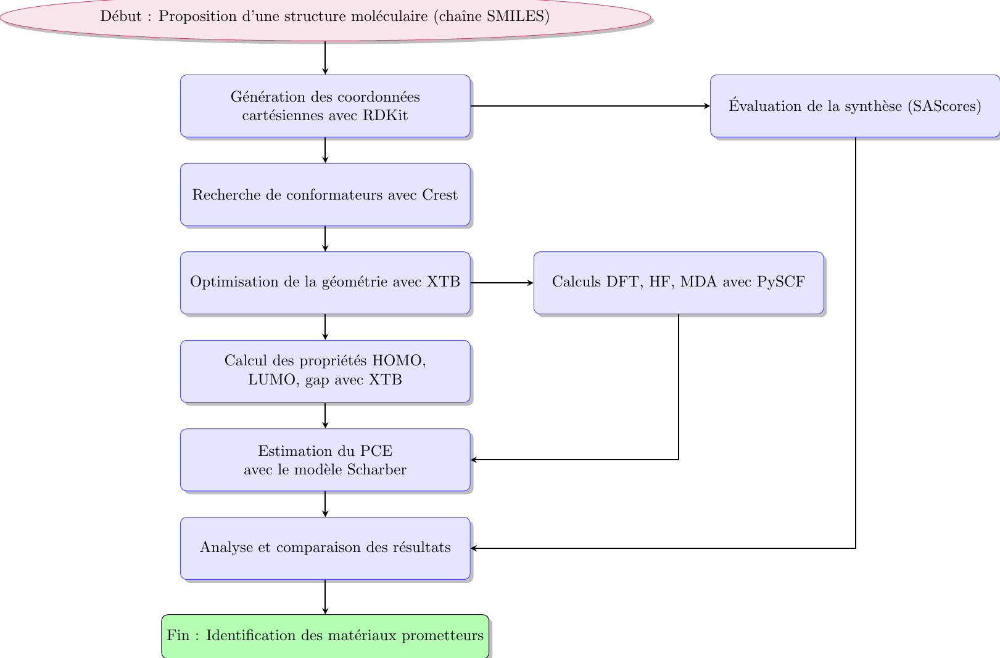

Notre premier ensemble d'objectifs de référence se compose de six tâches individuelles inspirées de la conception de photovoltaïques organiques (OPV). Le développement de cellules solaires organiques (OSC) présente un grand intérêt en raison de leur potentiel à remplacer les dispositifs inorganiques actuellement prédominants et à élargir leur domaine d'application.

Ce projet vise à calculer le PCE (Pouvoir de Conversion de Puissance) des cellules photovoltaïques organiques (OPV) en utilisant différentes méthodes de calcul combinées.

## Notre objectif de recherche consiste à concevoir des petites molécules dotées de propriétés électroniques spécifiques, notamment des molécules capables d'effectuer la séparation des charges, inspirées de la conception photovoltaïque organique (OPV). Nous avons deux tâches individuelles :

- Concevoir une petite molécule donneuse organique compatible avec le [phényl-C61-butyrate de méthyle] (PCBM) comme accepteur
- Concevoir une molécule accepteur organique compatible avec le [poly[N-9-heptadecanyl-2,7-carbazole-alt-5,5-(4,7-di-2- thienyl-2,1,3-benzote.

  
Le code accepte une structure proposée sous forme de chaîne SMILES, génère des coordonnées cartésiennes initiales avec rdkit et effectue une recherche de conformateur et une optimisation de la géométrie avec crest et xtb, respectivement. Enfin, un calcul en un seul point au niveau théorique GFN2-xTB fournit les propriétés d'intérêt, notamment les énergies HOMO et LUMO, le gap HOMO-LUMO et le moment dipolaire moléculaire. L'efficacité de conversion de puissance (PCE) est calculée à partir de ces propriétés simulées sur la base du modèle Scharber.
Calcul du PCE des OPV

# Workflow : Identification de matériaux prometteurs pour OPV

## Étapes principales

1. **Proposition de structure moléculaire** : La chaîne SMILES de la molécule cible est utilisée comme point de départ.
2. **Génération des coordonnées cartésiennes** : Utilisation de RDKit pour convertir la chaîne SMILES en coordonnées 3D.
3. **Recherche de conformateurs** : Exploration de la conformation avec Crest pour trouver des conformateurs optimaux.
4. **Optimisation géométrique** : Utilisation de XTB pour obtenir une géométrie optimisée.
5. **Calcul des propriétés électroniques** : Calcul des niveaux HOMO, LUMO, et gap énergétique à l'aide de XTB.
6. **Estimation du PCE** : Prédiction de l'efficacité de conversion d'énergie (PCE) avec le modèle de Scharber.
7. **Calculs avancés** : Approche DFT, HF, ou MDA pour des prédictions plus précises avec PySCF.
8. **Évaluation de la faisabilité synthétique** : Estimation de la difficulté de synthèse avec le SAScore.
9. **Analyse des résultats** : Comparaison des performances des matériaux.
10. **Identification des matériaux prometteurs** : Sélection des structures offrant les meilleures propriétés.

L'objectif principal de ce projet est de développer une méthodologie complète pour évaluer le potentiel des matériaux OPV en termes de PCE et de facilité de synthèse. Les résultats obtenus pourront aider à identifier les composés les plus prometteurs pour le développement de cellules photovoltaïques organiques performantes.
---

## Outils utilisés
- [RDKit](https://www.rdkit.org/) : Génération de géométries 3D.
- [Crest](https://www.crest-repo.de/) : Recherche de conformateurs.
- [XTB](https://xtb-docs.readthedocs.io/) : Calculs rapides de chimie quantique.

  
- [PySCF](https://pyscf.org/) : Calculs de structure électronique.
## Visualisation du Workflow
